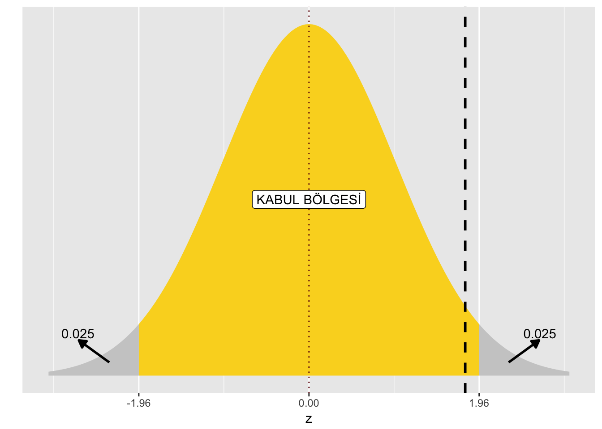

---
output:
  pdf_document: default
  html_document: default
---
# Testler {#tests}

## Test 1 - Bir popülasyon ortalaması için Z testi (bilinen varyans)

### Amaç

Popülasyon varyansı bilindiğinde bir varsayılan popülasyon ortalaması $\mu_{0}$ ve bir örneklem ortalaması $\overline{x}$ arasındaki anlamlığının araştırılması

### Kısıtlar

1.Popülasyon varyansı $\sigma^{2}$'nin bilinmesi gereklidir. ($\sigma^{2}$ bilinmiyorsa, bir popülasyon ortalaması için t testine bakınız.)
2. Popülasyon normal dağılıyorsa, test doğrudur. Normal dağılmıyorsa, test yine de yaklaşık bir sonuç verecektir.

### Yöntem

Ortalaması $\mu_{0}$ ve bilinen varyansı $\sigma^{2}$ olan bir popülasyondan, $n$ büyüklüğünde rastgele bir örneklem alınır ve örneklem ortalaması $\overline{x}$ hesaplanır. Test istatistiği olan

\begin{equation}
Z = \frac{\overline{x} - \mu_{0}}{\sigma / \sqrt{n}}
\end{equation}

bir veya iki yönlü ve $\alpha$ büyüklüğünde kritik bölgeye sahip standart normal dağılımla karşılaştırılabilir.

### Örnek

Belirli bir kozmetik yelpazesi için, yüz pudrasının olduğu kutuları doldurmak için ortalama 4 gm ve standart sapma 1 gm olacak şekilde bir doldurma işlemi yapılmaktadır. Bir kalite kontrol müfettişi rastgele dokuz kutudan numune almaktadır ve her bir kutudaki tozu tartmaktadır. Ortalama toz ağırlığı 4,6 gramdır. Dolgu işlemi hakkında neler söylenebilir? 

Aşırı ve az doldurma konusunda endişeliysek iki yönlü bir test kullanılabilir. Öte yandan, sadece kozmetik malzemenin fazla doldurulmasıyla ilgileniyorsak tek yönlü bir test uygundur.

**Sayısal Hesaplama**

$\mu_{0} = 4.0$, $n=9$, $\overline{x} = 4.6$, $\sigma = 1.0$, $\alpha = 0.05$ ($\%95$ güven düzeyine sahip)

$Z =  \dfrac{\overline{x} - \mu_{0}}{\sigma / \sqrt{n}} =  \frac{4.6 - 4.0}{1.0 / \sqrt{9}} = \frac{0.6}{1/3} = 1.8$

Eğer iki yönlü hipotez testi kullanmak isterseniz, kurmanız gereken hipotezler aşağıdaki gibidir:

$H_{0}: \mu = \mu_{0},\,\,\, H_{1}: \mu \neq \mu_{0}$. 

Bu durumda kabul bölgesi $−1.96 < Z < 1.96$'dır çünkü kritik değer $Z_{\alpha/2} = Z_{0.025} = 1.96$.


```r
library(ggplot2)
ggplot(NULL, aes(c(-3,1))) +
  geom_area(stat = "function", fun = dnorm, fill = "grey80", xlim = c(-3, -1.96)) +
  geom_area(stat = "function", fun = dnorm, fill = "#FAD623", xlim = c(-1.96, 1.96)) +
  geom_area(stat = "function", fun = dnorm, fill = "grey80", xlim = c(1.96, 3)) +
  geom_vline(xintercept = 0, color = "#6C0606", linetype = "dotted") +
  geom_vline(xintercept = 1.8, color = "#000000", lwd=1, linetype = "dashed") +
  labs(x = "z", y = "") +
  scale_y_continuous(breaks = NULL) +
  scale_x_continuous(breaks = c(-1.96, 0, 1.96))+
  annotate("label", x = 0, y = 0.2, label = "KABUL BÖLGESİ")+
  annotate("segment", x = 2.3, xend = 2.65, y = 0.015, yend =0.04,
           colour = "black", size = 0.95, arrow = arrow(type = "closed", length = unit(0.02, "npc"))) +
  annotate("text", x=2.66, y=0.048, label='0.025')+
  annotate("segment", x = -2.3, xend = -2.65, y = 0.015, yend =0.04,
           colour = "black", size = 0.95, arrow = arrow(type = "closed", length = unit(0.02, "npc"))) +
  annotate("text", x=-2.66, y=0.048, label='0.025')
```



Test istatistiği, taralı alan olan kabul bölgesine düstüğü için $H_{0}$ boş hipotezini red edemezsiniz. Yani, bu numune (örneklem) için doldurma işleminin hedefte çalışmadığını öne sürmek için hiçbir neden yoktur.

Eğer tek yönlü hipotez testi kurmak isteseydiniz, kuracağınız hipotezler aşağıdaki gibidir:

$H_{0}: \mu = \mu_{0},\,\,\, H_{1}: \mu > \mu_{0}$.

Bu durumda kabul bölgesi $Z < 1.65$'dır çünkü kritik değer $Z_{\alpha} = Z_{0.05} = 1.65$'tir.


```r
library(ggplot2)
ggplot(NULL, aes(c(-3,1))) +
  geom_area(stat = "function", fun = dnorm, fill = "#AB1616", xlim = c(-3, 1.65)) +
  geom_area(stat = "function", fun = dnorm, fill = "grey80", xlim = c(1.65, 3)) +
  geom_vline(xintercept = 0, color = "#6C0606", linetype = "dotted") +
  geom_vline(xintercept = 1.8, color = "#000000", lwd=1, linetype = "dashed") +
  labs(x = "z", y = "") +
  scale_y_continuous(breaks = NULL) +
  scale_x_continuous(breaks = c(-1.65, 0, 1.65))+
  annotate("label", x = 0, y = 0.2, label = "KABUL BÖLGESİ")+
  annotate("segment", x = 2.3, xend = 2.65, y = 0.015, yend =0.04,
           colour = "black", size = 0.95, arrow = arrow(type = "closed", length = unit(0.02, "npc"))) +
  annotate("text", x=2.66, y=0.048, label='0.05')
```


Test istatistiği, taralı alan olan kabul bölgesine düşmediği için $H_{0}$ boş hipotezini red edebilirsiniz. Yani, kutuları kozmetik ile aşırı doldurduğumuzdan makul bir şekilde şüphelenebiliriz.

### R-kodu


```r
mu0 <- 4.0
n <- 9
xbar <- 4.6
sigma <- 1.0

Z <- (xbar - mu0) / (1 / sqrt(n))
Z
```

```
## [1] 1.8
```

İki yönlü hipotez testlerine ait p-değerini R kodu kullanarak da bulabiliriz. Yukarıdaki ilk grafiğe bakıldığında  $H_{0}$ boş hipotezini red edebilmek için Z değerinin mutlak değerce 1.8'den büyük olma olasılığı bulmamız gerekmektedir.

\begin{equation}
\begin{split}
P \left( |Z| \geq 1.8 \right) &= P(Z \geq 1.8) + P(Z \leq -1.8) \\
&= 1 - P(Z \leq 1.8) + P(Z \leq -1.8) \\
&= 1 - \phi(1.8) +\phi(-1.8)\\
\end{split}
\end{equation}

Burada $\phi$ normal dağılımın birikimli (kümülatif) dağılım fonksiyonudur.


```r
1 - pnorm(1.8, mean=0, sd=1) + pnorm(-1.8, mean=0, sd=1)
```

```
## [1] 0.07186064
```

O halde p-değeri 0.07186064'dir. Bu p-değeri, belirlediğimiz anlamlılık düzeyi $\alpha = 0.05$'ten büyük olduğu için $H_{0}$ boş hipotezini red edemezsiniz.

## Test 2 - 

## Test 3 - 

## Test 4 - 
